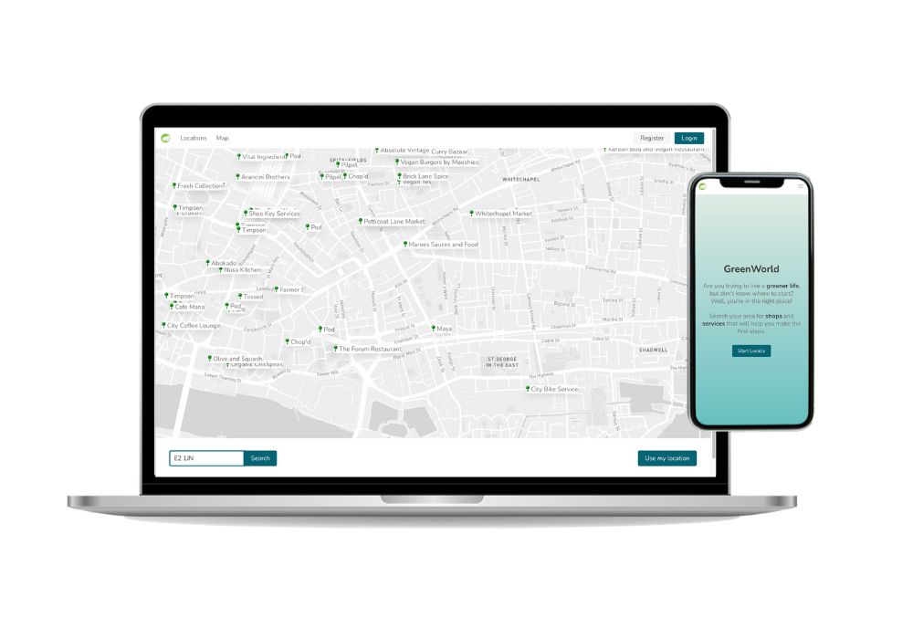
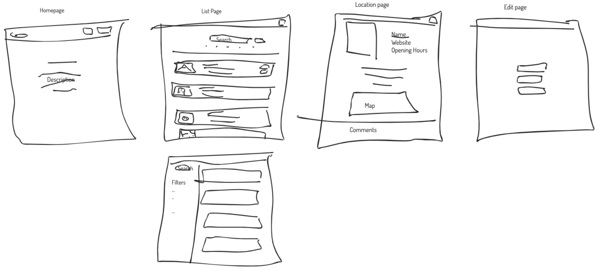
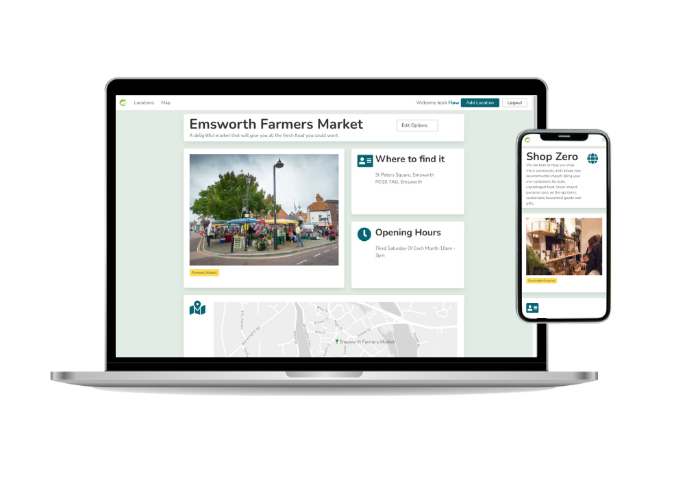
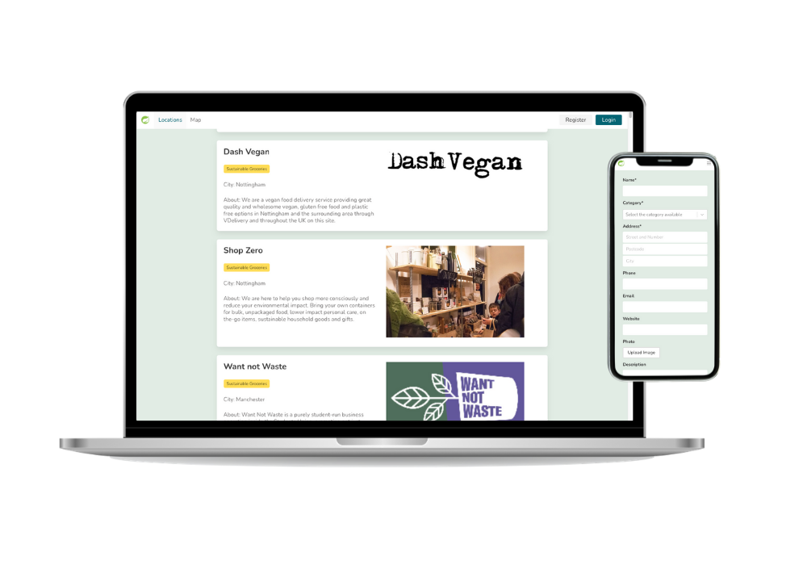

##  General Assembly, Software Engineering Immersive
# Project #3: A MERN Stack App

```
  ___|                         \ \        /              |      | 
 |      __|   _ \   _ \  __ \   \ \  \   /   _ \    __|  |   _` | 
 |   | |      __/   __/  |   |   \ \  \ /   (   |  |     |  (   | 
\____|_|    \___| \___| _|  _|    \_/\_/   \___/  _|    _| \__._|  
```


[**Visit GreenWorld on heroku**](https://flows-project-3.herokuapp.com/)

## Overview

We were asked to build a MERN stack app, in groups of 4 students and 7 days.

### Technical Requirements

* Work in a team, using **git to code collaboratively**.
* **Build a full-stack application** by making your own backend and your own front-end
* **Use an Express API** to serve your data from a Mongo database
* **Consume your API with a separate front-end** built with React
* **Be a complete product** which most likely means multiple relationships and CRUD functionality for at least a couple of models
* **Implement thoughtful user stories/wireframes** that are significant enough to help you know which features are core MVP and which you can cut
* **Have a visually impressive design** to kick your portfolio up a notch and have something to wow future clients & employers. **ALLOW** time for this.
* **Be deployed online** so it's publicly accessible.

### Concept 
We chose to build a platform to help you live a greener life: ***GreenWorld***. The idea was to enable users to **easily find local businesses and services that lower the carbon footprint** (Vegan/vegetarian restaurants, cycling shops, ethical groceries, EV charging stations, repair shops, charity shops etc.).

### Key features:
* A map with pins for all 'green' locations in the UK
* "Use my location" button to capture browser location of user
* List of all locations, with search by name and filter by categry
* Pages for each location with location details, comments and ratings
* User accounts and profiles
* Ability for users to comment and rate locations
* Ability for users to add and edit locations
* Responsive design

### Wireframes


## Technologies

* HTML
* CSS / SASS
* Bulma
* JavaScript (ES6)
* React
* Git and GitHub
* MongoDB
* Express
* Node.js
* Ziteboard
* APIs
	* [Yelp](https://www.yelp.com/developers/documentation/v3)
	* [mapbox](https://docs.mapbox.com/api/)
* [Cloudinary](https://cloudinary.com/)

## Approach
### AddLocation.js
The AddLocation page is a form that captures each keystroke in a `const` via `useState`.

```
const [formData, updateFormData] = useState({
  category: [],
  address: '',
  name: '',
  timings: '',
  [...]
})

function handleChange(event) {
  const data = {
    ...formData,
    [event.target.name]: event.target.value
  }
  updateFormData(data)
  }
```

For the category selection we used a the `react-select` library. And for the image upload we used *Cloudinary*.

When the user clicks the 'Submit' button, the postcode gets sent to the geocoding endpoint of the *mapbox* API. 

```
function handleSubmit(event) {
  event.preventDefault()
[...]
  }
  Axios.get(`https://api.mapbox.com/geocoding/v5/mapbox.places/${formData.postcode}.json?access_token=${process.env.MapBoxKey}`)
    .then(resp => {
      const data = {
        ...formData,
        longitude: resp.data.features[0].center[0],
        latitude: resp.data.features[0].center[1]
      }
      updateFormData(data)
[...]
```

This returns the corresponding coordinates and is necessary for us to place a pin on the map for this location.
The complete information typed in the form and returned from the *mapbox* API is then stored in our database.

```
[...]
return Axios.post('/api/locations', data, {
  headers: { Authorization: `Bearer ${token}` }
})
  .then((resp) => {
    if (resp.data.errors) {
      updateErrors(resp.data.errors)
    } else {
      props.history.push('/locations')
    }
  })
[...]
```

### (Navbar)
### Seed.js
For seeding, we send our 30 hardcoded locations to *mapbox* and return the coordinates (similarly to what's done on AddLocation.js). Then these get added to a global variable.

```
  .then((newData) => {
    newData.map(item => {
      globalArray.push(item)
    })   
```

And we create a temporary array for the external entries, that are being requested from the *Yelp* API. These 800+ entries are being requested by looping a request of 50 items every 1200ms.

```
    const rawYelpData = []        
    for (let i = 0; i < 17; i++) {
      const timeoutInterval = 1200 * (i + 1)
      const limit = 50
      rawYelpData.push(new Promise((resolve) => {
        setTimeout(() => {
          axios.get(`https://api.yelp.com/v3/businesses/search?location=UK&limit=${limit}&offset=${limit * i}&categories=vegan,farmersmarket,vegetarian,salad,bikerepair,bikeshop,organic_stores,ethicgrocery,bike_repair_maintenance,electronicsrepair,furniturerepair,shoerepair,evchargingstations,vintage,fleamarkets`,
            { headers:
              { Authorization: `Bearer ${process.env.YelpKey}` }
            })
            .then(resp => {
              resolve(resp.data.businesses)
            })
        }, timeoutInterval)
      }))
    }
    return Promise.all(rawYelpData)
  })
```

Each *Yelp* item then gets tweeked to match our model, before being store in our global array.

```
  .then((rawYelpData) => {
    rawYelpData.forEach(array => {
      array.map(item => {
        const yelpCatArray = item.categories.map(cat => cat.alias)           
        const categoryAliasesArray = []
        categoriesArray.forEach(i => categoryAliasesArray.push(i.alias))
        const yelpAlias = categoryAliasesArray.filter(e => yelpCatArray.includes(e))[0]
        const catObj = categoriesArray.find(o => o.alias === yelpAlias)
        const data = {          
          category: [catObj['category']],
          name: item.name,
          address: (item.location.address1 ? item.location.address1 : '**Not provided**') + 
          (item.location.address2 ? ', ' + item.location.address2 : '')
           + (item.location.address3 ? ', ' + item.location.address3 : ''),
          city: (item.location.city ? item.location.city : '**Not provided**'),
          postcode: (item.location.zip_code ? item.location.zip_code : '**Not provided**'),
          longitude: item.coordinates.longitude,
          latitude: item.coordinates.latitude,
          website: item.url,
          phone: item.display_phone,
          image: item.image_url,
          user: globalUsers[0]          
        }
        globalArray.push(data)
      })
    })
    return globalArray
  })
```

## Challenges

The biggest challenge certainly was to get Seed.js setup in a way where we could merge various sources of data (ie hardcoded data and external data via the API).
We ultimately solved this by using `globalArray`.

Furthermore, matching the Yelp categories to our apps categories proved to be challenging. In the end we managed to do it in the following way, but it feels convoluted:

```
const categoriesArray = [
  { alias: 'vegan', category: 'Restaurant' },
  { alias: 'farmersmarket', category: 'Farmers Market' },
  { alias: 'vegetarian', category: 'Restaurant' },
	[...]
  { alias: 'fleamarkets', category: 'Circular Economy' }
]

[...]

  .then((rawYelpData) => {
    rawYelpData.forEach(array => {
      array.map(item => {
        const yelpCatArray = item.categories.map(cat => cat.alias)           
        const categoryAliasesArray = []
        categoriesArray.forEach(i => categoryAliasesArray.push(i.alias))
        const yelpAlias = categoryAliasesArray.filter(e => yelpCatArray.includes(e))[0]
        const catObj = categoriesArray.find(o => o.alias === yelpAlias)
        const data = {          
          category: [catObj['category']],
          [...]
```

Another challenge was the amount of data we were trying to retrieve from the Yelp API. Given that each response was limited to 50 items we had to ensure we were running it often enough with the appropriate intervals.

```
	for (let i = 0; i < 17; i++) {
	  const timeoutInterval = 1200 * (i + 1)
	  const limit = 50
	  [...]
```
This works great but could still be improved. For ex by checking the length of the response in the first request and then calculate the number of loops necessary dynamically from there.

## Improvements

One of the major flaws to our app is related to the way we're populating the listings for the site. We were hoping that we could get all relevant data from *Yelp* during the seeding process, but it turned out that the location parameter in the API call (`?location=UK`) only selected one arbitrary point in the UK and would give us results for that point plus a radius of approximately 50 miles. This means that we currently only have locations in London (plus 30 that were hardcoded in our seed file, as our early test data).

We weren't aware of this behaviour and only found out when it was too late. After discovering this, we think that when doing a map/postcode search, instead of calling our own database, we should be calling the *Yelp* API live in order to always get relevant results for that region.


## Screenshots


## Contributors
- Baltasar Romero
- Dec Burns
- Florian Wilisch
- James Bolton